## flexible-yolov5

Mainly based on [ultralytics/yolov5](https://github.com/ultralytics/yolov5) 5.x. The 6.x is coming.

The original Yolo V5 was an amazing project. When I want to make some changes to the network, it's not so easy, such as adding branches and trying other backbones. Maybe there are people like me, so I split the yolov5 model to {backbone, neck, head} to facilitate the operation of various modules and support more backbones.Basically, I only changed the model, and I didn't change the architecture, training and testing of yolov5. Therefore, if the original code is updated, it is also very convenient to update this code. if this repo can help you, please give me a star. This repo mainly depend on origin yolov5 release 5.0 !!!

## Table of contents
* [Features](#features)
* [Notices](#Notices)
* [Prerequisites](#prerequisites)
* [Getting Started](#getting-started)
    * [Dataset Preparation](#dataset-preparation)
    * [Training and Testing](#Training-and-Testing)
    * [Detection](#Detection)
    * [Deploy](#Deploy)
* [Reference](#Reference)


## Features
- Reorganize model structure, such as backbone, neck, head, can modify the network flexibly and conveniently
- mobilenetV3-small, mobilenetV3-large 
- shufflenet_v2_x0_5, shufflenet_v2_x1_0, shufflenet_v2_x1_5, shufflenet_v2_x2_0
- yolov5s, yolov5m, yolov5l, yolov5x, yolov5transformer
- resnet18, resnet50, resnet34, resnet101, resnet152 
- efficientnet_b0 - efficientnet_b8, efficientnet_l2
- hrnet 18,32,48
- CBAM, SE
- swin transformer - base, tiny, small, large (please set half=False in scripts/eval.py and don't use model.half in train.py)
- DCN (mixed precision training not support, if you want use dcn, please close amp in line 292 of scripts/train.py)
- coord conv
- drop_block
- vgg, repvgg

## Notices

* The CBAM, SE, DCN, coord conv. At present, the above plug-ins are not added to all networks, so you may need to modify the code yourself.
* The default gw and gd for PAN and FPN of other backbone are same as yolov5_s, so if you want a strong model, please modify self.gw and self.gd in FPN and PAN.

## Prerequisites

please refer requirements.txt

## Getting Started

### Dataset Preparation

Make data for yolov5 format. you can use od/data/transform_voc.py convert VOC data to yolov5 data format.

### Training and Testing

For training and Testing, it's same like yolov5.

### Training

1. check out configs/data.yaml, and replace with your data， and number of object nc
2. check out configs/model_*.yaml, choose backbone. and change nc to your dataset. please refer support_backbone in models.backbone.__init__.py
3. 
```shell script
$ python scripts/train.py  --batch 16 --epochs 5 --data configs/data.yaml --cfg configs/model_XXX.yaml
```

A google colab demo in train_demo.ipynb

### Testing and Visualize

```shell script
$ python scripts/eval.py   --data configs/data.yaml  --weights runs/train/yolo/weights/best.py
```

### Model performance comparison 

Because the training takes too much time, each model has only trained 150 epoch on coco2014. You can download it to continue training, and the model can continue to converge. The following model is different only from the backbone network, which is compared with yolov5s. The following table can be used as a performance comparison. But the results may not reflect the performance of the model correctly. For reference only.


------------------------------

efficientnet-b1 [链接: https://pan.baidu.com/s/1DdghRgq28g6p01ilS6x2AQ 提取码: 7w6m]

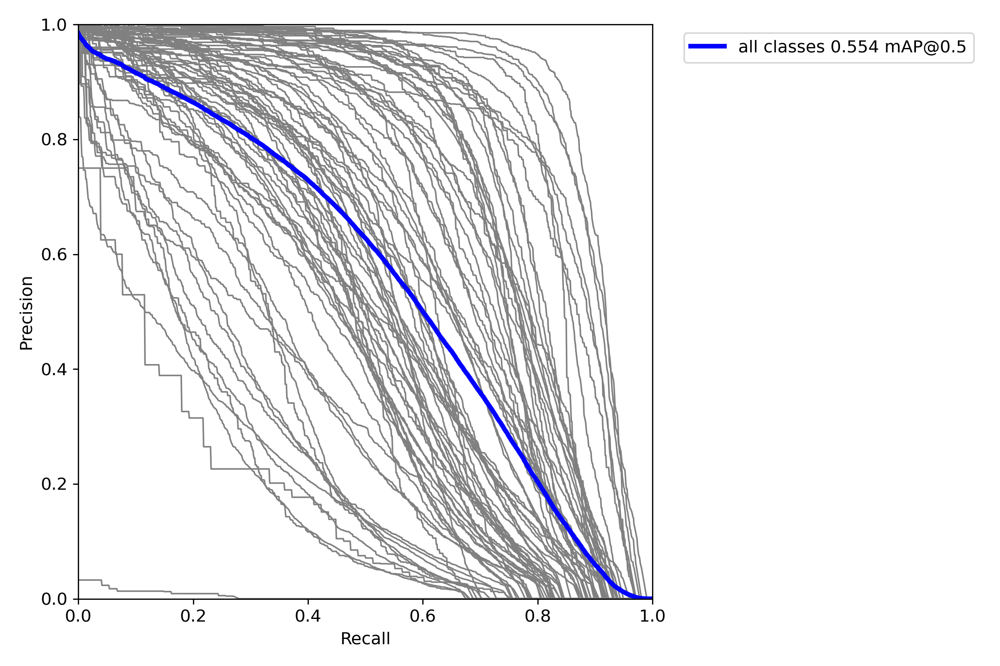

hrnet-18[链接: https://pan.baidu.com/s/1u64w5nk7QDxjYHkArV7OWw 提取码: ka9g]

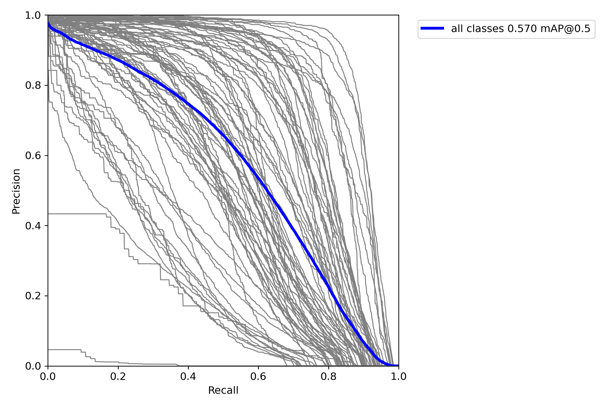

mobilenet-v3-small[链接: https://pan.baidu.com/s/1kKMHK9eKVh-p383qaAxIWg 提取码: j4he]

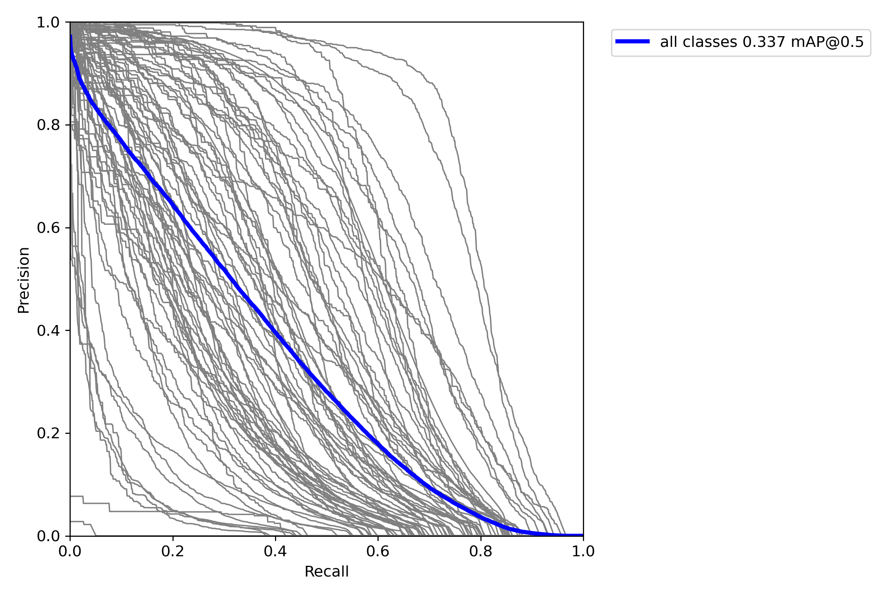

repvgg-A0[链接: https://pan.baidu.com/s/1bxn0H_fGGguYQe7UJOjB6g 提取码: hsk3]

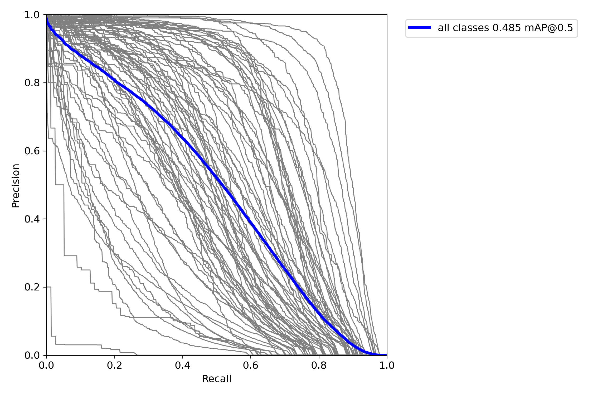

resnet18[链接: https://pan.baidu.com/s/11z78S84urfq5J0HvCPayyQ 提取码: 27ep]

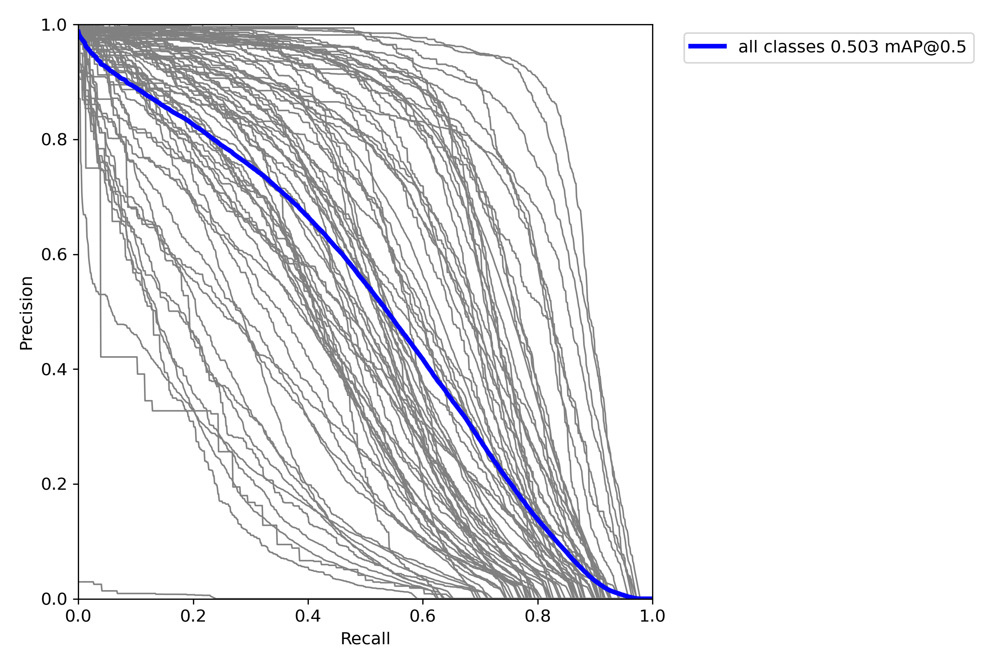

resnet18-cbam[链接: https://pan.baidu.com/s/1hGwdtudqmBnFOz018sQRXA 提取码: tm7n]

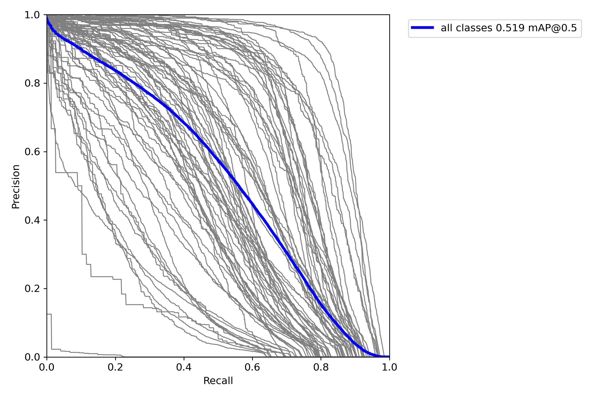

resnet18-dcn[链接: https://pan.baidu.com/s/1Z-YLzrQTFxH7xBpAsObvWQ 提取码: witg]

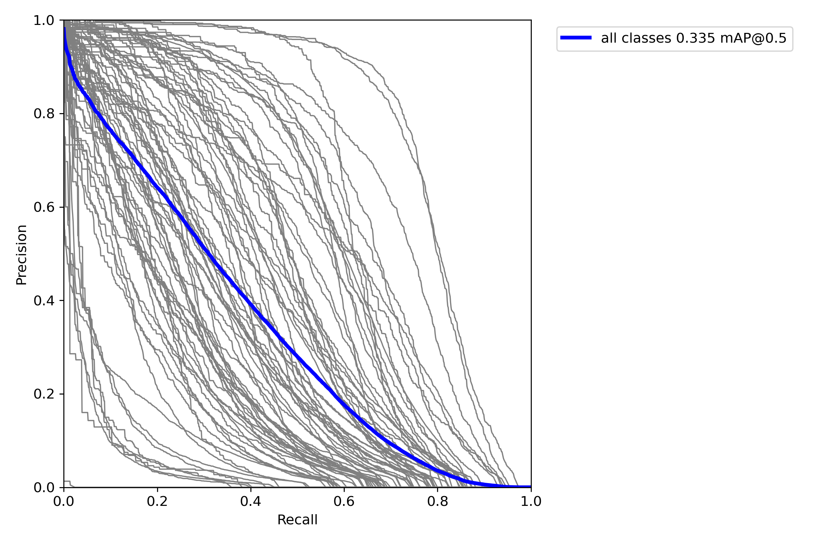

resnet18-dropblock[链接: https://pan.baidu.com/s/13mMBI_Kjjs6h68DFY8IRDw 提取码: 7iff]

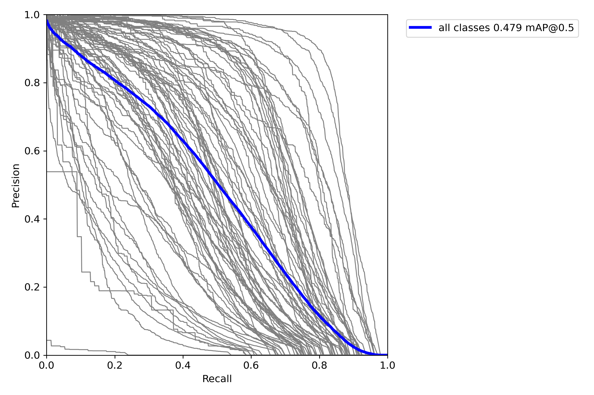

shufflenetv2_x0.5[链接: https://pan.baidu.com/s/1KKtPn4pQjOI8iDhlGrp5kg 提取码: d8h8]

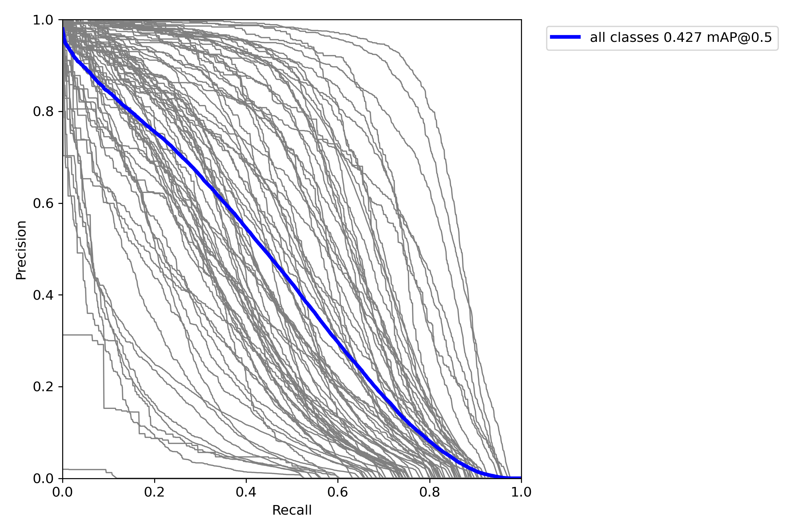

swin-tiny[链接: https://pan.baidu.com/s/15ecdj2O3a-U6FD9zh0d2bA 提取码: v9i4]

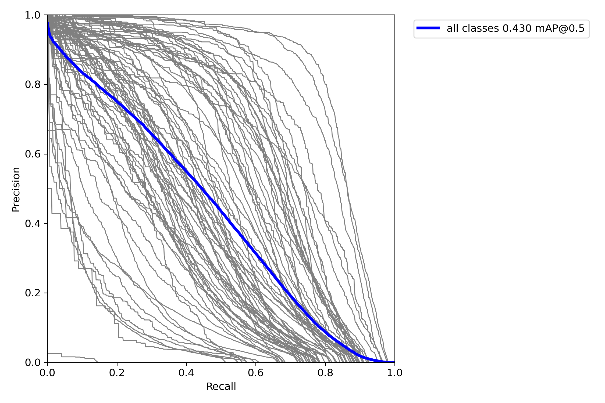

vgg-16bn[链接: https://pan.baidu.com/s/1TN6Lobi3ORrbQKbWlxVdTQ 提取码: nqv2]

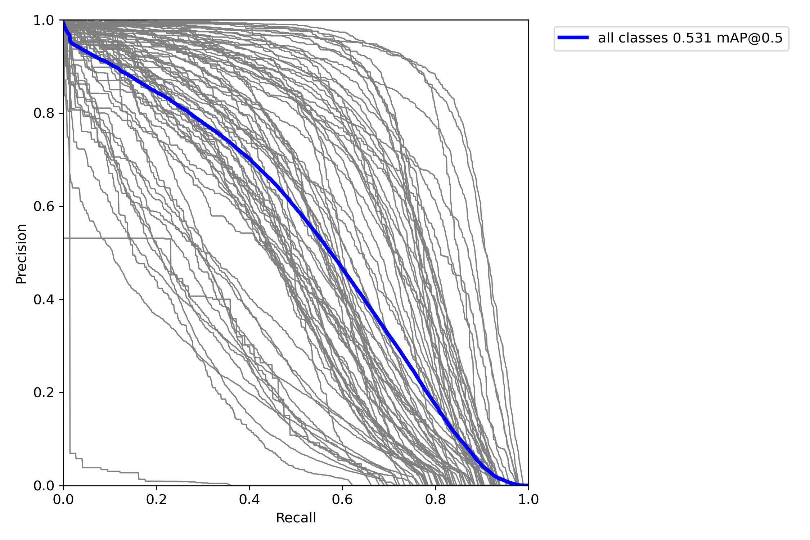

yolov5s[链接: https://pan.baidu.com/s/1Mc1J4t03qrslj1mywaWqBw 提取码: chtr]

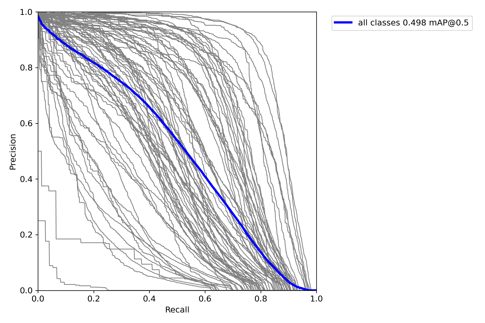

yolov5s-c3tr[链接: https://pan.baidu.com/s/14komD827Mal8rX-0YiHIoQ 提取码: clo1]

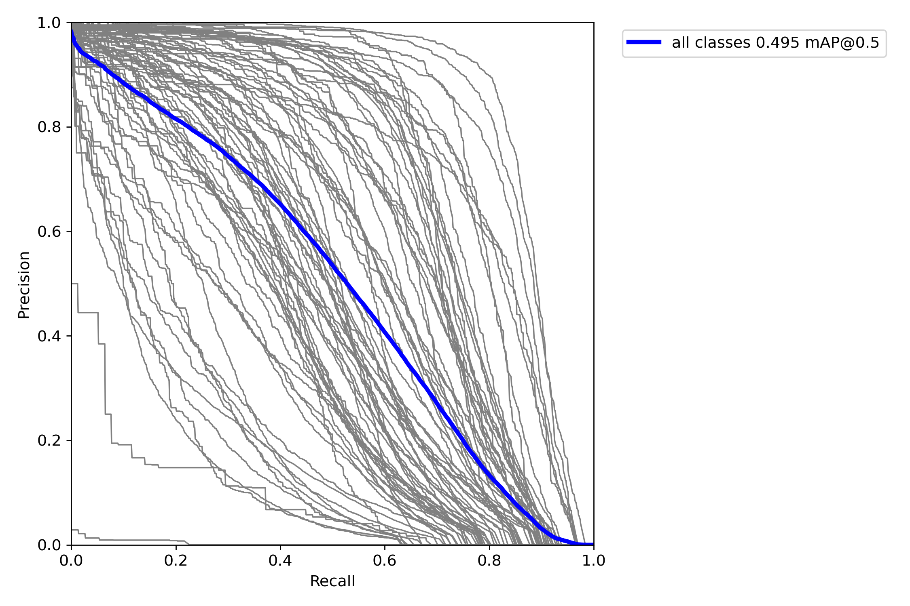

--------------------------
### Detection

```shell
python scripts/detector.py   --weights yolov5.pth --imgs_root  test_imgs   --save_dir  ./results --img_size  640  --conf_thresh 0.4  --iou_thresh 0.4
```

### Deploy

For tf_serving or triton_server, you can set model.detection.export = False in scripts/deploy/export.py in line 50 to export an onnx model, A new output node will be added to combine the three detection output nodes into one. 
For Official tensorrt converter, you should set model.detection.export = True, because  ScatterND op not support by trt. For this repo, best use official tensorrt converter, not [tensorrtx](https://github.com/wang-xinyu/tensorrtx)

#### Quantization

You can directly quantify the onnx model

```shell
python scripts/trt_quant/convert_trt_quant.py  --img_dir  /XXXX/train/  --img_size 640 --batch_size 6 --batch 200 --onnx_model runs/train/exp1/weights/bast.onnx  --mode int8
```
[See](scripts/trt_quant/README)

trt python infer demo scripts/trt_quant/trt_infer.py


## bugs fixed

- ~~resnet with dcn, training on gpu *RuntimeError: expected scalar type Half but found Float~~
- ~~swin-transformer, training is ok, but testing report *RuntimeError: expected object of scalar type Float but got scalar type Half for argument #2 'mat2' in call to_th_bmm_out in swin_trsansformer.py 143~~
- ~~mobilenet export onnx failed, please replace HardSigmoid() by others, because onnx don't support pytorch nn.threshold~~
## Reference

* [ultralytics/yolov5](https://github.com/ultralytics/yolov5)
* [EfficientNet-PyTorch](https://github.com/lukemelas/EfficientNet-PyTorch)
* [Mobilenet v3](https://arxiv.org/abs/1905.02244)
* [resnet](https://arxiv.org/abs/1512.03385)
* [hrnet](https://arxiv.org/abs/1908.07919)
* [shufflenet](https://arxiv.org/abs/1707.01083)
* [swin transformer](https://github.com/SwinTransformer/Swin-Transformer-Object-Detection)
* [dcn-v2](https://github.com/jinfagang/DCNv2_latest)
* [coord_conv](https://github.com/mkocabas/CoordConv-pytorch)
* [triton server](https://github.com/triton-inference-server/server)
* [drop_block](https://github.com/miguelvr/dropblock)
* [trt quan](https://github.com/Wulingtian/nanodet_tensorrt_int8_tools)
* [repvgg](https://github.com/DingXiaoH/RepVGG)
