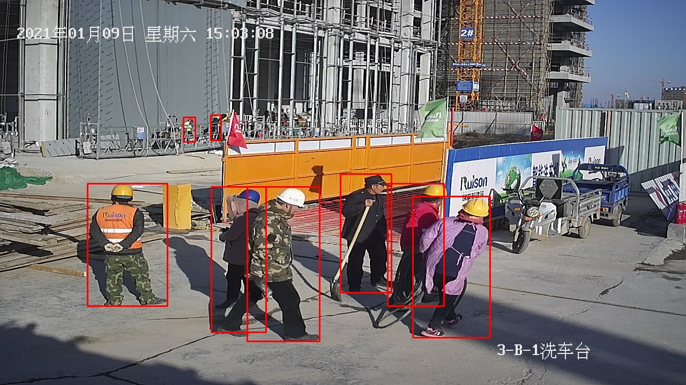
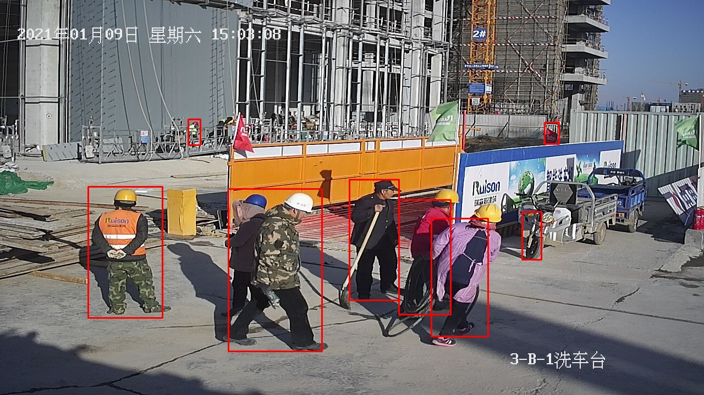

## flexible-yolov5

Based on [ultralytics/yolov5](https://github.com/ultralytics/yolov5).

The original Yolo V5 was an amazing project. For professionals, it should not be difficult to understand and modify its
 code. I'm not an expert. When I want to make some changes to the network, it's not so easy, such as adding branches and
  trying other backbones. Maybe there are people like me, so I split the yolov5 model to {backbone, neck, head} to 
  facilitate the operation of various modules and support more backbones.Basically, I only changed the model, and I 
  didn't change the architecture, training and testing of yolov5. Therefore, if the original code is updated, it is also
   very convenient to update this code. if this repo can help you, please give me a star.

原始的yolov5是个了不起的开源项目。但是作者构建网络都是以解析config文件的形式进行，当然了，对于编码高手来说，理解、修改网络并不难, 对于我这种菜鸟来说, 以config 
文件构建网络不太直观，魔改起来也很困难。因此，自己花了一点时间, 将YOLOv5的网络部分进行剥离, 参照主流的 pytorch 网络构建形式, 分成 backbone, neck, head
进行插件式构建, 实现支持 resnet, mobilenet, shufflenet, 当然了别的backbone也可以轻松的集成进去, 对于小模块, 如 SE, CBAM 集成也很方便. 本人基本只改了网络构建
代码, 训练、测试、数据生成等基本没有大的改动. 注意: 由于整个代码结构改了, 所以暂时无法加载作者提供的预训练权重, 但是由于YOLOv5这个训练外壳设计的很好，即使没有预训练权重训练收敛也很快.

## Table of contents
* [Features](#features)
* [Notices](#Notices)
* [Prerequisites](#prerequisites)
* [Getting Started](#getting-started)
    * [Dataset Preparation](#dataset-preparation)
    * [Training and Testing](#Training-and-Testing)
    * [Detection](#Detection)
    * [Deploy](#Deploy)
* [Reference](#Reference)


## Features
- Reorganize model structure, such as backbone, neck, head, can modify the network flexibly and conveniently
- mobilenetV3-small, mobilenetV3-large 
- shufflenet_v2_x0_5, shufflenet_v2_x1_0, shufflenet_v2_x1_5, shufflenet_v2_x2_0
- yolov5s, yolov5m, yolov5l, yolov5x, yolov5transformer
- resnet18, resnet50, resnet34, resnet101, resnet152 
- efficientnet_b0 - efficientnet_b8, efficientnet_l2
- hrnet 18,32,48
- CBAM, SE
- DCN (mixed precision training not support, if you want use dcn, please close amp in line 292 of scripts/train.py)
- coord conv
- drop_block

## Notices

The CBAM, SE, DCN, coord conv. At present, the above plug-ins are not added to all networks, so you may need to modify the code yourself

## Prerequisites

please refer requirements.txt

## Getting Started

### Dataset Preparation

Make data for yolov5 format. you can use od/data/transform_voc.py convert VOC data to yolov5 data format.

### Training and Testing

For training and Testing, it's same like yolov5.

### Training

1. check out configs/data.yaml, and replace with your data， and number of object nc
2. check out configs/model_*.yaml, choose backbone. and change nc to your dataset. please refer support_backbone in models.backbone.__init__.py
3. 
```shell script
$ python scripts/train.py  --batch 16 --epochs 5 --data configs/data.yaml --cfg confgis/model_XXX.yaml
```

### Testing and Visualize
Same as [ultralytics/yolov5](https://github.com/ultralytics/yolov5)


### Detection

see detector.py

### Deploy

For tf_serving or triton_server, you can set model.detection.export = False in scripts/deploy/export.py in line 50 to export an onnx model, A new output node will be added to combine the three detection output nodes into one. 
For Official tensorrt converter, you should set model.detection.export = True, because  ScatterND op not support by trt. For this repo, best use official tensorrt converter, not [tensorrtx](https://github.com/wang-xinyu/tensorrtx)

## Some results

I train yolo with backbone of  MobileNetV3, resnet50, shufflenet_v2_x1_0 on my dataset for person detection(27K images).

*For time reason, for each backbone, i only train 15 epochs, Here's the test comparison,*

resnet50:


MobileNetV3:


shufflenet_v2_x1_0:


## bugs

- ~~resnet with dcn, training on gpu *RuntimeError: expected scalar type Half but found Float~~
## Reference

* [ultralytics/yolov5](https://github.com/ultralytics/yolov5)
* [EfficientNet-PyTorch](https://github.com/lukemelas/EfficientNet-PyTorch)
* [Mobilenet v3](https://arxiv.org/abs/1905.02244)
* [resnet](https://arxiv.org/abs/1512.03385)
* [hrnet](https://arxiv.org/abs/1908.07919)
* [shufflenet](https://arxiv.org/abs/1707.01083)

